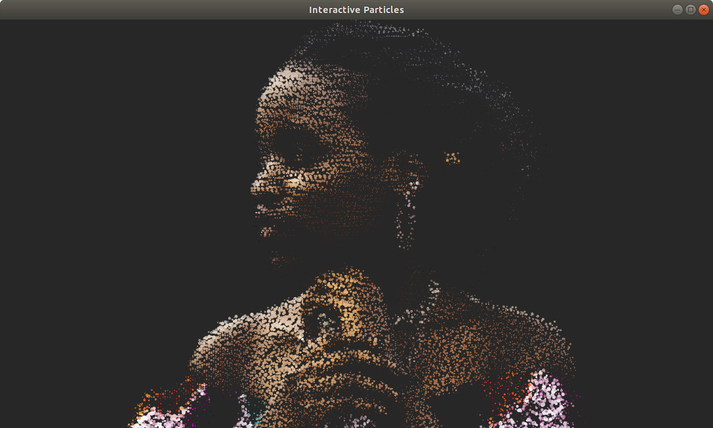

# Interactive Particles with Three.js

照着Bruno Imbrizi的Interactive Particles代码和教程自己写了一遍，主要是为了熟悉ES6和Webpack配置。

[Codrops上的教程](https://tympanus.net/codrops/2019/01/17/interactive-particles-with-three-js/)

[Demo](https://guijiangheng.github.io/interactive-particles/)

## Run
- Install `npm install`
- Run `npm start`
- Build `npm run build`
